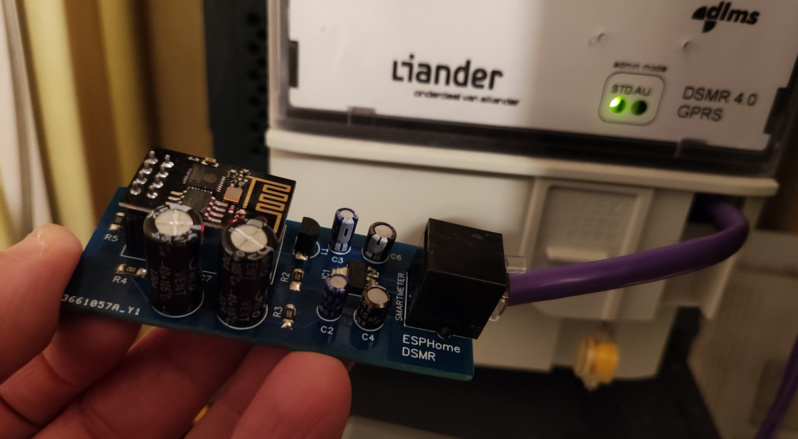

# An ESPHome DSMR smart meter reader

An ESPHome smartmeter project (hardware + ESPHome config).
This device is compatible with the energy dashboard that was introduced in Home Assistant 2021.8.0.

# Compatibility

The device is directly powered by the smart meter. This has been tested with a DSMR v4.2 and a  DSMR v5.0 meter.

I have a **DSMR v4.2** meter myself, which delivers enough current to power the ESP-01 MCU (100 mA). It does require a 1000 uF capacitor though, to handle the power peak of the ESP-01 during startup and connecting to the WiFi network. Therefore, I did solder the 1000 uF capacitor onto the board, and connected the DSMR4 jumper.

A **DSMR v5** meter provides more power (250 mA) and can drive the ESP-01 MCU without additional capacitance. In fact, when using a 1000 uF capacitor, the ESP-01 got stuck in a reboot loop when connecting the device to the smart meter. The device does work without the 1000 uF capacitor. You have two options here: don't solder the capacitor onto the board, or solder it but leave the DSMR4 jumper disconnected to disable the capacitor.

Please let me know if you find additional compatibility outcomes.

# Parts list

### For both DSMR v4 and v5

* 2 x Capacitor 4.7uF
* 2 x Capacitor 10uF
* 1 x 3.3V regulator, SMD AMS1117 3.3V
* 1 x female header 2x4 (for holding the ESP-01 MCU)
* 1 x ESP-01
* 3 x Resistor SMD 1k 1206 (3216 metric)
* 1 x Resistor SMD 10k 1206 (3216 metric)
* 1 x RJ12 female socket
* 1 x Transistor 2N2222 TO92
* 1 x Male-male RJ12 cable, to connect the device to the smart meter

Note: instead of 1206, you might also use 0805.
The 1206 version is a bit less fiddly to solder by hand.

### For DSMR v4 only

For DSMR v4, a 1000uF capacitor is required to handle the startup peak.
Required parts for this setup:

* 1 x Capacitor 1000uF
* 1 x male header 1x2
* 1 x jumper to connect the male header pins

Alternatively, you can omit the DSMR4 jumper, and simply bridge the
jumper pins with some wire.

Recommended is to use a header and jumper, to allow connecting the device
to a DSMR v5 meter in the future by simply disconnecting the jumper.

### Breakout pins

If you want to connect something to the unused pins of the ESP-01 (TX, GPIO0, GPIO2),
then you can install a 6-pin header to the board.

### For flashing the ESP-01

Because GND, 3V3, RXD and TXD are exposed from the breakout pins, it is feasible
to flash the ESP-01 while it is installed on the board.
To be able to get the ESP-01 into flashing mode easily, you can install a reset
and a flash button (or you could for example use a jumper for the flash mode).

# Prototype

Before desiging the final board from above, I designed and built a prototype.
Here's what this one looked like:

# Credits

The circuit that I used as a starting point for my board:
https://klushok.etv.tudelft.nl/projects/view?id=8

This page had a good collection of info about the P1 port:
http://domoticx.com/p1-poort-slimme-meter-hardware/

